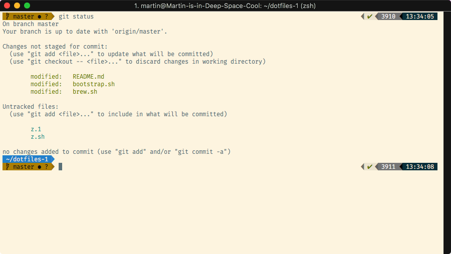

# martinwheeler's dotfiles



## Installation

**Warning:** If you want to give these dotfiles a try, you should first fork this repository, review the code, and remove things you don’t want or need. Don’t blindly use my settings unless you know what that entails. Use at your own risk!

## Setup Steps

First clone the repoistory to wherever you want. Secondly run the scripts in top down order. If you don't want Oh-My-Zsh then skip the first script and only run the `bootstrap.sh` file.

```bash
git clone https://github.com/martinwheeler/dotfiles.git && cd dotfiles
```

```bash
./zsh.sh
./bootstrap.sh
```

Some of the functionality of these dotfiles depends on formulae installed by `brew.sh`. If you don’t plan to run `brew.sh`, you should look carefully through the script and manually install any particularly important ones. A good example is Bash/Git completion: the dotfiles use a special version from Homebrew.